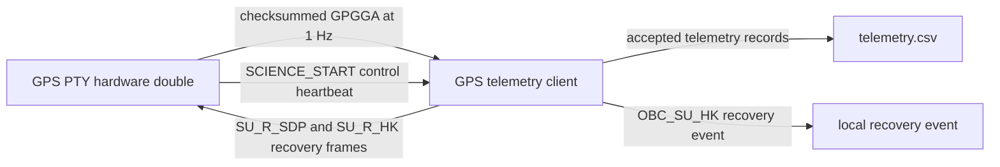

# GPS Telemetry System: An SDD Hardware-Double Example

This repository is a small, didactic example of **Spec-Driven Development (SDD)** applied to
hardware-facing Python code. It uses a Linux pseudo-terminal (PTY) as a hardware double for a GPS
receiver, so the telemetry client can be specified, implemented, and tested without physical UART
hardware.

It is an educational prototype, not flight-qualified software or a substitute for hardware
integration and certification.

## What This Demonstrates

The project turns an Interface Control Document (ICD) into progressively more concrete artifacts:

1. Governing engineering principles in `.specify/memory/constitution.md`.
2. Functional requirements and acceptance criteria in `specs/001-gps-telemetry/spec.md`.
3. Architecture, contracts, data model, research decisions, and a quickstart guide in
   `specs/001-gps-telemetry/`.
4. Dependency-ordered, test-first implementation tasks in
   `specs/001-gps-telemetry/tasks.md`.
5. A Python client, a PTY hardware double, and automated unit/integration tests.
6. A convergence pass that identifies and closes remaining gaps after implementation.

The authoritative source requirement document is [GPS System Requirements and ICD.md](GPS%20System%20Requirements%20and%20ICD.md).

## System Overview



`gps_double.py` creates a PTY master/slave pair and prints the slave device path. The client opens
that slave path with the same `pyserial` configuration it would use for a hardware UART. This makes
the operating-system serial path part of the test, rather than replacing it with an in-memory mock.

## Behavior

### Telemetry Flow

- The simulator emits a hardcoded, checksummed `$GPGGA` sentence once per second.
- The client accepts only `$GPGGA` input with non-empty UTC, latitude, and longitude fields and a
  valid two-digit NMEA XOR checksum.
- Valid records are appended to `telemetry.csv` only while the client is in `SCIENCE`.
- The CSV columns are `utc_timestamp`, `latitude`, `longitude`, and `persisted_at`.

### State Machine

| State | Purpose | Main transition |
|---|---|---|
| `INIT` | Create and configure the serial connection. | Successful initialization moves to `STANDBY`. |
| `STANDBY` | Connected, but does not write telemetry. | `SCIENCE_START` (`0x01`) moves to `SCIENCE`. |
| `SCIENCE` | Validate and log GPS telemetry. | A timeout or incomplete packet moves to `ERROR`. |
| `ERROR` | Execute fail-safe recovery. | Recovery records an event and attempts shutdown actions. |

The simulator emits the `SCIENCE_START` control frame every 250 ms. This acts as a control
heartbeat so the active serial session remains synchronized with the mandatory 500 ms packet
deadline while GPS data remains at 1 Hz.

### Command Frame

Commands use this binary frame:

```text
0x7E | CMD_ID | LEN | DATA[LEN] | XOR
```

`XOR` is calculated over `CMD_ID`, `LEN`, and every data byte.

| Command | Value | Purpose |
|---|---:|---|
| `SCIENCE_START` | `0x01` | Transition from `STANDBY` to `SCIENCE`. |
| `SU_R_SDP` | `0x02` | Recovery action requesting science data. |
| `SU_R_HK` | `0x03` | Recovery action requesting housekeeping data. |

Unknown commands and frames with an invalid start byte, length, or XOR are rejected without a
state change.

### Timeout and Recovery

A missing or incomplete packet triggers `SyncError` after a configured 500 ms serial timeout. In
the automated timing test, the observed timeout is required to be between 500 ms and 550 ms.

When recovery starts, the client records these actions in order:

1. `ABORT`
2. Send `SU_R_SDP` (`0x02`)
3. Send `SU_R_HK` (`0x03`)
4. Emit the local `OBC_SU_HK` recovery event
5. `TURN_OFF`

The recovery event is created even when the disconnected serial device cannot accept the two
outbound recovery frames.

## Requirements

- Linux
- Python 3.11 or later
- `pyserial` 3.5

Create and activate a virtual environment if desired:

```bash
python3 -m venv .venv
source .venv/bin/activate
python3 -m pip install -r requirements.txt
```

## Run the Tests

From the repository root:

```bash
python3 -W error::ResourceWarning -m unittest discover -p 'test_*.py'
```

The suite covers:

- NMEA `$GPGGA` field and checksum validation.
- Command-frame encoding, XOR validation, and unknown-command rejection.
- Little-endian preservation of multi-byte command payload data.
- UART 9600 8N1 configuration.
- State transitions, state-gated CSV writing, timeout behavior, and recovery ordering.
- PTY master/slave communication, recovery-frame observation, 1 Hz NMEA intervals, and PTY loss.

The generated `telemetry.csv` file is ignored by Git and is removed by the test workflow.

## Run the Simulator and Client

Start the simulator in one terminal:

```bash
python3 gps_double.py
```

It prints a path such as `/dev/pts/3`. In a second terminal, use that path:

```bash
python3 gps_client.py /dev/pts/3
```

The simulator automatically sends control heartbeats and valid NMEA records. The client enters
`SCIENCE` after a `SCIENCE_START` frame and writes accepted records to `telemetry.csv` in the
current directory. Stop the simulator with `Ctrl+C`; the client detects the disconnection and
enters its error-recovery path.

## Spec Kit Workflow

This repository was initialized for GitHub Copilot with Spec Kit. The relevant generated assets
are intentionally committed:

- `.github/skills/`: Copilot commands such as `/speckit.specify` and `/speckit.implement`.
- `.specify/`: Spec Kit templates, scripts, workflow metadata, and project constitution.
- `specs/001-gps-telemetry/`: The feature-specific SDD artifacts.

The completed flow was:

```text
/speckit.constitution
/speckit.specify
/speckit.clarify
/speckit.plan
/speckit.tasks
/speckit.analyze
/speckit.implement
/speckit.converge
/speckit.implement
```

For a new change, begin by describing the desired behavior with `/speckit.specify`, then repeat the
specification, clarification, planning, tasking, implementation, and convergence cycle. Keep the
ICD updated when interface requirements change.

## Repository Layout

```text
.
├── GPS System Requirements and ICD.md  # Source requirements and interface contract
├── README.md                            # This guide
├── requirements.txt                     # Python runtime dependency
├── gps_client.py                        # Serial client, state machine, parser, and CSV writer
├── gps_double.py                        # Linux PTY hardware double
├── test_parser.py                       # Parser and command-frame unit tests
├── test_client.py                       # Client, state, recovery, and CSV tests
├── test_integration.py                  # Real PTY integration and disconnection tests
├── .github/skills/                      # Spec Kit command definitions for Copilot
├── .specify/                            # Spec Kit project configuration and constitution
└── specs/001-gps-telemetry/             # Specification, plan, tasks, contract, and guides
```

## Traceability

The implementation plan maps the ICD requirements to their planned verification in
[specs/001-gps-telemetry/plan.md](specs/001-gps-telemetry/plan.md). The completed task list provides
additional requirement-level traceability in [specs/001-gps-telemetry/tasks.md](specs/001-gps-telemetry/tasks.md).

## Limits of the Example

The PTY double validates the client against a real Linux serial-device interface, but it does not
prove behavior on a physical UART. In particular:

- `pyserial` configures 9600 8N1 but cannot control or measure on-wire LSB-first bit order.
  Verify that behavior with the selected UART hardware and integration evidence.
- The two independent 10 MB mass-memory units and the ten connector mate/de-mate cycle limit are
  physical deployment responsibilities; the client and simulator do not emulate them.
- The NMEA source data, command IDs, and recovery event are deliberately minimal so the project
  remains a clear teaching example.
